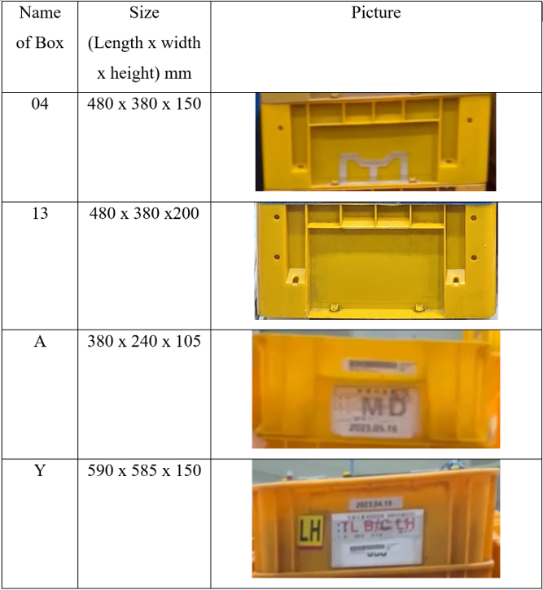
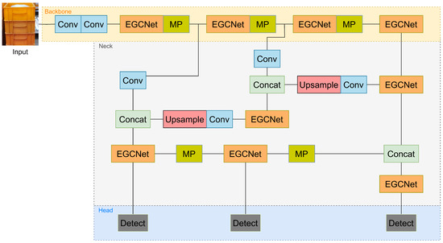
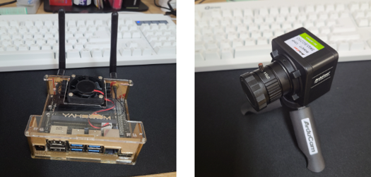

# EGCY-Net: ELAN & GhostConv-Based YOLO for Stacked Packages in Logistic Systems

> End-to-end vision system that **classifies box availability**, **detects box types (`04`, `13`, `A`, `Y`)**, and **counts quantities** for AGV-driven logistics. Implemented on **Jetson Nano + Arducam IMX477** and benchmarked against SOTA detectors. 


## TL;DR / Highlights
- **Two-stage pipeline**: (1) **Box availability** classifier (MobileNet) on cropped RoI; (2) **EGCY-Net** detector (YOLOv7 base with **CGStack** & **EGCNet**) to identify box **type** and **count**.
- **Dataset**: Factory images/videos → curated & labeled; **4 box types (04, 13, A, Y)**; **1258 images** for detection; availability set: **1200 “box” + 1200 “no box”** frames. 
- **Results (20-epoch comparison)**: EGCY-Net achieves **best mAP@0.5:0.95** on all/most classes with **fewest params (~30M)**, **smallest ONNX (111MB)**, and **fastest inference (5.96s)** among tested models. 
- **Embedded deployment**: Converted **PyTorch → ONNX**, optimized for **Jetson Nano**. 


---

## Abstract
Manual recognition/counting of stacked packages slows logistics. We present **EGCY-Net**, a one-stage YOLOv7-based detector enhanced with a **Conv-GhostConv Stack (CGStack)** and an **ELAN-GhostConv module (EGCNet)** to better capture hierarchical features with fewer parameters. Together with a lightweight **MobileNet** classifier for **box/no-box** availability, the system achieves high precision/recall and competitive mAP while remaining deployable on embedded hardware.

---

## Dataset

### 1) Box Availability (classification)
- **Classes**: `box`, `no box`  
- **Source**: Factory video → **RoI cropping** → frame extraction  
- **Size**: **1200** images per class (JPG)  
- **Usage**: Train MobileNet for availability in storage RoIs. 

### 2) Box Type & Quantity (detection)
- **Classes**: `04`, `13`, `A`, `Y`  
- **Total images**: **1258** (JPG), collected from smartphone/Arducam; cropped to single stacks for speed. 
- **YOLO format** with txt labels: `<class cx cy w h>` (normalized)  
- **Suggested split (paper)**:
  - Train/Val/Test per class (example table in paper): `04 (420/80/12), 13 (420/80/34), A (420/80/40), Y (420/80/22)`.

<p align="center">
  
</p>
---

## Method

### Pipeline
1) **Availability**: MobileNet on RoI → `box` / `no box`. 
2) **Type & Count**: **EGCY-Net** (YOLOv7 backbone) → per-stack detection; then **count boxes per class** with size/score thresholds (pseudo-code in paper).
   
### EGCY-Net Architecture (overview)
- **Backbone**: `Conv → EGCNet (ELAN + CGStack) → MP`  
- **Neck**: `Conv/Upsample/MP/Concat + EGCNet` with **multi-scale feature fusion**  
- **Head**: `IDetect` (three scales: S/M/L)  
- **CGStack**: `1×1 Conv → GhostConv → 1×1 Conv` (reduces params while preserving spatial features)  
- **EGCNet**: ELAN-style layer aggregation + two CGStacks to stabilize gradients and enrich features.

<p align="center">
  
</p>

---

## Implementation
- **Training env (paper)**: Linux, CUDA 11.8, cuDNN 8.1; RTX 4090 for training; **Jetson Nano** for deployment; **Arducam IMX477** camera.  
- **Formats**: Train in PyTorch → export **ONNX** for Jetson. 
- **Availability model**: Input ~`128×128×3`, ~15 epochs, batch 8 (paper example).
- 
<p align="center">
  
</p>
---

## Results

### Comparison vs SOTA (20 epochs, paper setting)
**EGCY-Net** vs **YOLOv3 / YOLOv5l / YOLOR / YOLOv7 / YOLOv7x**:

- **All classes (mAP@0.5:0.95)**: **EGCY-Net 87.1%** (best)  
- **Per class (mAP@0.5:0.95)**: `04: 86.5%`, `13: 87.3%`, `A: 86.6%`, `Y: 88.6%`  
- **Params**: **~30M** (fewest) • **ONNX**: **111MB** (smallest) • **Inference time**: **5.96 s** (fastest of compared set)  
(Table and qualitative examples in the paper.) 

### Visualization & Domain Robustness
t-SNE feature maps indicate **better class separation** and **cross-camera robustness** (smartphone ↔ Arducam) for EGCY-Net vs YOLOv7. 

> For your repo, drop comparison screenshots under `./figures/results/` and short clips in `./videos/`.

---

## Demo Media
### 📦 Box Availability Recognition

<p align="center">
  
</p>


### 🧰 Box Type & Quantity Recognition

<table>
  <thead>
    <tr>
      <th>Box 04</th>
      <th>Box 13</th>
      <th>Box A</th>
      <th>Box Y</th>
    </tr>
  </thead>
  <tbody>
    <tr>
      <td width="25%"></td>
      <td width="25%"></td>
      <td width="25%"></td>
      <td width="25%"></td>
    </tr>
  </tbody>
</table>

### 🧰 Result of detecting only the first row of boxes

<table>
  <thead>
    <tr>
      <th colspan="2" align="center">Box 13</th>
      <th colspan="2" align="center">Box 04</th>
    </tr>
  </thead>
  <tbody>
    <tr>
      <td style="padding:6px;"></td>
      <td style="padding:6px;"></td>
      <td style="padding:6px;"></td>
      <td style="padding:6px;"></td>
    </tr>
  </tbody>
</table>

<table>
  <thead>
    <tr>
      <th colspan="2" align="center">Box A</th>
      <th colspan="2" align="center">Box Y</th>
    </tr>
  </thead>
  <tbody>
    <tr>
      <td style="padding:6px;"></td>
      <td style="padding:6px;"></td>
      <td style="padding:6px;"></td>
      <td style="padding:6px;"></td>
    </tr>
  </tbody>
</table>


---

## Publication
**EGCY-Net: An ELAN and GhostConv-Based YOLO Network for Stacked Packages in Logistic Systems**  
*Applied Sciences*, **14**(7):2763, **26 March 2024**.  
Authors: **Indah Monisa Firdiantika**, Seongryeong Lee, Chaitali Bhattacharyya, Yewon Jang, **Sungho Kim***.  
DOI: `10.3390/app14072763`. 

- **Paper PDF**: put your copy at `./paper.pdf`

---

## Patent
**Artificial neural network for automated box recognition, box recognition method and computing device, and recording medium thereof**  
KIPO application no. **10-2024-0046794**, **filed 2024-04-05**.  
Applicant: **Yeungnam University Industry-Academic Cooperation Foundation**.  
Inventors: **Sungho Kim**, **Indah Monisa Firdiantika**, Seongryeong Lee, Chaitali Bhattacharyya, Yewon Jang. 

- **Patent PDF**: put your copy at `./patent.pdf`

---

## Folder Structure
```

projects/egcy-net/
├─ README.md
├─ paper.pdf           # Applied Sciences paper
├─ patent.pdf          # KIPO application PDF
├─ figures/
│  ├─ cover.jpg
│  ├─ architecture.png
│  └─ results/
│     ├─ sample_01.jpg
│     └─ sample_02.jpg
└─ videos/
├─ detect_smartphone.mp4
├─ detect_arducam.mp4
└─ agv_workflow.mp4

````

---

## Citation
If you use this work, please cite:

```bibtex
@article{Firdiantika2024EGCYNet,
  title   = {EGCY-Net: An ELAN and GhostConv-Based YOLO Network for Stacked Packages in Logistic Systems},
  author  = {Firdiantika, Indah Monisa and Lee, Seongryeong and Bhattacharyya, Chaitali and Jang, Yewon and Kim, Sungho},
  journal = {Applied Sciences},
  year    = {2024},
  volume  = {14},
  number  = {7},
  pages   = {2763},
  doi     = {10.3390/app14072763}
}
````

## Contact

* **Indah Monisa Firdiantika, M.S.** — add your email / LinkedIn
* Department of Electronic Engineering, Yeungnam University

```

---


