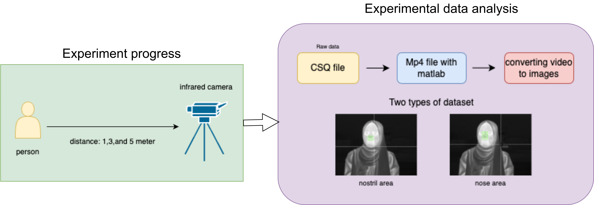

**Face Areas (RGB+IR)** — Multimodal detection of forehead/nose/cheeks with RGB–IR fusion; robust in low light.   
  **Goal:** detect nostril and nose areas to estimate respiration rate. 
  **Dataset:** Public dataset + AVIL dataset; Train **3,391** images, Val **338** images.  
  **Method:**  
  - **Nostril detection:** leverage infrared to capture airflow-induced thermal changes. 
  - **Nose-area detection:** track global nose motion to capture breathing signal. 

**Dataset & Experiment Setup**  
- Participant recorded with an **infrared camera** at **1 m, 3 m, and 5 m** distances.  
- **Processing pipeline:** CSQ raw files → converted to **MP4 with MATLAB** → **video-to-image** extraction.  
- **Two annotation types:** **nostril area** and **nose area**.

  

    
  

  
**Dataset Information**  
- Sources: **Public dataset + AVIL dataset**  
- Train: **3,391** images | Val: **338** images

**Objective**  
Detect the **nostril** and **nose** regions to estimate **respiration rate**.

**Method**  
- **Nostril detection:** leverage thermal cues sensitive to **airflow-induced temperature changes**.  
- **Nose-area detection:** **track global nose motion** to recover the breathing signal.

**Results**  
Sample IR frames show successful detection of **nostril** and **nose** regions.

<table>
  <tr>
    <td align="center" width="50%">
      
       <b>Nostril area detection</b>
    </td>
    <td align="center" width="50%">
      
       <b>Nose area detection</b>
    </td>
  </tr>
</table>

