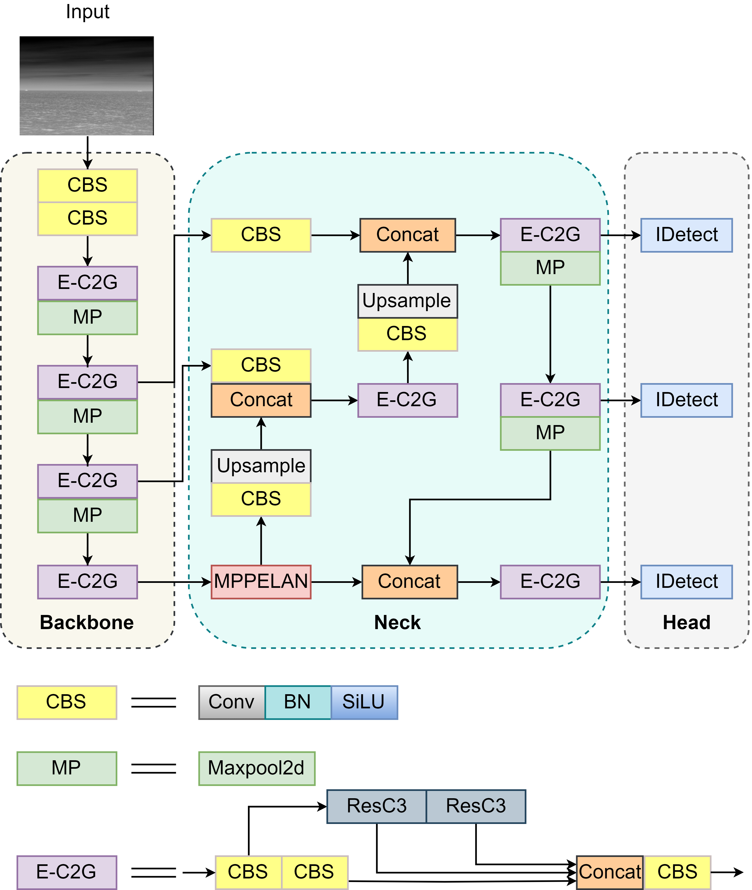

# Small Ship Detection in Infrared Images (IS-YOLO)

> YOLOv7-based detector tailored for **small ship** targets in **infrared (IR)** imagery with heterogeneous sea backgrounds.

## Highlights
- **IS-YOLO** introduces lightweight yet effective backbone/neck upgrades (E-C2G, ResC3, **MPPELAN**) to improve **small-target** recognition in IR scenes with glare, clutter, waves, fog, islands, and shorelines. 
- Trained and validated on a **FLIR T620**–captured small-ship IR dataset from Yeungnam University (**1,370 train / 120 val**), with additional tests on **SIRST-v2** and **IRSTD-1k** for generalization.
- Achieves **AP@0.5 = 88.9%** and **AP@0.5:0.95 = 38.3%**, outperforming strong baselines (YOLOv7/8/9, Faster R-CNN, RetinaNet, FCOS) while keeping parameters and model size competitive.

---
## Publication
**IS-YOLO: A YOLOv7-based Detection Method for Small Ship Detection in Infrared Images With Heterogeneous Backgrounds**  
*International Journal of Control, Automation, and Systems*, 22(11), 3295–3302, 2024.  
DOI: 10.1007/s12555-024-0044-8.

> **Paper PDF:** `./paper.pdf`

---

## Patent
**Method for detecting small object in infrared image and system thereof**  
Korean Patent Application No. **10-2024-0040244**, filed **2024-03-25**; Applicant: **Yeungnam University Industry-Academic Cooperation Foundation**; Inventors: **Sungho Kim, Indah Monisa Firdiantika**. 

> **Patent PDF:** `./patent.pdf`

---

## Abstract
Ship detection in infrared imagery is challenging due to **low signal-to-clutter ratios**, indistinct contours, small apparent sizes, and complex sea background. We propose **IS-YOLO**, a YOLOv7-based framework designed to enhance feature extraction and multi-scale fusion for **small IR targets**. The backbone replaces E-ELAN blocks with **E-C2G (ELAN-2Conv + GhostConv)** and integrates a **ResC3** unit to reduce redundancy and improve gradient flow. The neck adopts **MPPELAN**, a max-pooling-pyramid ELAN variant that strengthens multi-scale context aggregation. On our FLIR-captured maritime IR dataset and public benchmarks, IS-YOLO improves precision/recall and AP metrics over state-of-the-art detectors.

---

## Method
### Architecture at a Glance
- **Backbone:** E-C2G (ELAN-2Conv + GhostConv) + **ResC3**  
  *Motivation:* richer features with shorter/longer gradient paths balanced; reduce parameter redundancy while preserving representational power. 
- **Neck:** **MPPELAN** (Max-Pooling Pyramid-ELAN)  
  *Motivation:* robust **multi-scale fusion** using stacked conv + multi-kernel max-pooling, concatenation, and refinement conv to capture local details and global context for small targets. 
- **Head:** YOLOv7 detection head (multi-scale outputs). 

> **Why it helps small targets:** small ships often appear with weak texture and are easily confused by sea clutter; **E-C2G + MPPELAN** increases discriminative features and stabilizes small-object cues across scales. 

<p align="center">
  
</p>

---

## Dataset
- **Source:** Yeungnam University maritime IR small-ship dataset captured with **FLIR T620**.  
- **Format:** YOLO labels.  
- **Split:** **1,370** training images, **120** validation images.  
- **Scene diversity:** multiple regions; varied target counts (1–9 per image); heterogeneous sea backgrounds. 

> **Public benchmarks used for comparison:** **SIRST-v2** (512 images; urban/interference-heavy) and **IRSTD-1k** (1,000 IR images; drones/creatures/vessels/vehicles across diverse scenes). 


<p align="center">
  

</p>

---

## Training & Evaluation
- **Environment (paper setup):** Python 3.8.19, PyTorch 2.2.1, CUDA 11.2; Ryzen 9 7950X, RTX 4090; Ubuntu 23.04.  
- **Typical config:** image size 640×640, batch size 1, epochs 50, Adam optimizer, LR 0.01. 
- **Metrics:** AP@0.5, AP@0.5:0.95, Params, Model Size, GFLOPs, Inference Time. 

---

## Results

### Main (Ablations, Own IR Dataset)
| Model Variant | AP@0.5 | AP@0.5:0.95 | Params (M) | Model Size (MB) |
|---|---:|---:|---:|---:|
| YOLOv7 (ELAN+SPPCSPC) | 86.5 | 34.9 | 36.4 | 71.3 |
| ELAN + MPPELAN | 84.6 | 35.5 | 28.8 | 59.6 |
| E-C2G + SPPCSPC | 83.9 | 33.5 | 40.4 | 81.5 |
| E-C2G + SPPELAN | 84.1 | 35.6 | **32.8** | **63.1** |
| **IS-YOLO (E-C2G + MPPELAN)** | **88.9** | **38.3** | **32.8** | **63.1** |
<sub>Numbers from the paper’s ablation table.

### Cross-Method Comparison (Own IR Dataset)
| Method | AP@0.5 | AP@0.5:0.95 | Params (M) | Size (MB) |
|---|---:|---:|---:|---:|
| YOLOv7 | 86.5 | 34.9 | 36.4 | 71.3 |
| Faster R-CNN | 84.0 | 30.9 | – | 533 |
| FCOS | 77.3 | 28.8 | – | 244 |
| RetinaNet | 79.6 | 29.1 | – | 278 |
| YOLOv8-l | 84.9 | 35.2 | 43.6 | 83.7 |
| YOLOv9 | 83.9 | 32.0 | 60.4 | 116 |
| **IS-YOLO** | **88.9** | **38.3** | **32.8** | **63.1** |
<sub>IS-YOLO outperforms across AP metrics with competitive complexity. 
### Public Benchmarks
**SIRST-v2**
- YOLOv7: P 89.1 / R 65.7 / AP@0.5 71.6 / AP@0.5:0.95 30.7  
- **IS-YOLO:** P 88.3 / **R 77.4** / **AP@0.5 80.3** / **AP@0.5:0.95 32.6** 

**IRSTD-1k**
- YOLOv7: P 85.3 / R 78.3 / AP@0.5 82.2 / AP@0.5:0.95 32.5  
- **IS-YOLO:** P 84.6 / **R 79.7** / **AP@0.5 82.8** / **AP@0.5:0.95 33.6** 

---


## How to Use This Folder
```

ai-ml-portfolio/Computer Vision/Small Ship Detection (IS-YOLO)/
├─ README.md             
├─ paper.pdf             
├─ patent.pdf             
├─ architecture.png   
└─ result.png

````

---

## Citation
If you use IS-YOLO or this dataset description, please cite the paper:

```bibtex
@article{Firdiantika2024ISYOLO,
  title   = {IS-YOLO: A YOLOv7-based Detection Method for Small Ship Detection in Infrared Images With Heterogeneous Backgrounds},
  author  = {Indah Monisa Firdiantika and Sungho Kim},
  journal = {International Journal of Control, Automation, and Systems},
  year    = {2024},
  volume  = {22},
  number  = {11},
  pages   = {3295--3302},
  doi     = {10.1007/s12555-024-0044-8}
}
````


